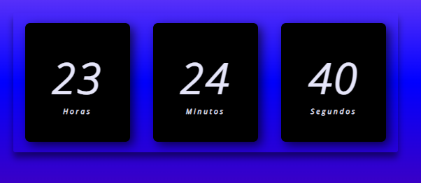

# relogiodigital

Este é um relógio digital simples (fuso horário BRT) criado apenas para treinar conhecimentos básicos em HTML, CSS e Javascript.

Acesse aqui: https://nathyalves.github.io/relogiodigital/
